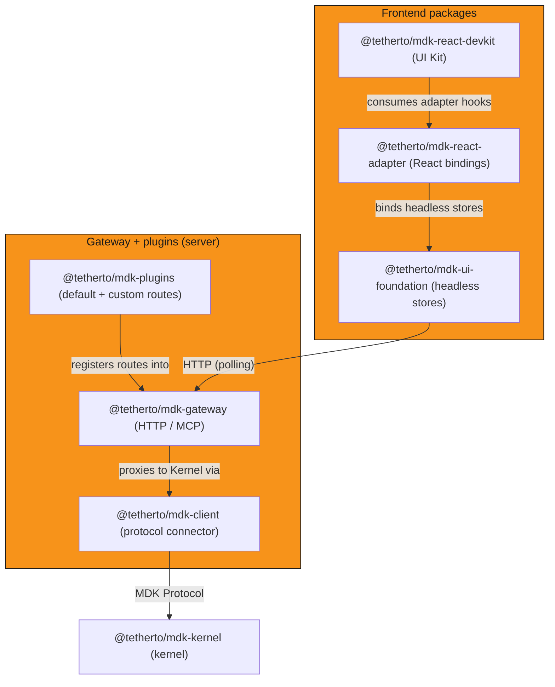

## Overview

The MDK App Toolkit is the recommended development path for teams building MDK-powered applications. It is composed of three coordinated layers: the Gateway
backend, the plugin system, and the frontend packages. Not every layer is required for every consumer type.

MDK supports two primary consumer patterns:

- **Human operator UI**: a frontend application connects to the Gateway's REST API and polls it for live data, so the full three-layer toolkit applies
- **AI agent or headless consumer**: an AI agent connects over MCP, either a standalone [`@tetherto/mdk-mcp`][mcp-readme] process or one the Gateway auto-generates
  in-process from a plugin's routes. The frontend packages are not required

## Gateway layer

`@tetherto/mdk-gateway` is the backend component of the toolkit: a container that hosts plugins and delivers an HTTP interface for consumers that need those
capabilities. The [Gateway's developer model][gateway-concept] covers its extension patterns, data access, auth design, and Kernel connection.

## Plugin system

`@tetherto/mdk-plugins` is the extension mechanism the Gateway mounts its routes from. The toolkit auto-loads several plugins and ships `auth` alongside them, and
[any plugin you write][plugins-how-to] loads by the same mechanism.

## Frontend packages

These packages serve the **human operator UI** pattern: the application layer that connects to the Gateway's REST API and polls it for live data. If your consumer
is an AI agent connecting over MCP, this layer is not required.

Consuming applications add the workspace dependencies directly, and consuming the whole chain is the recommended path for operator UIs. The
[frontend package architecture][ui-architecture] carries the full dependency graph, build strategy, and package internals.

- **[`@tetherto/mdk-ui-foundation`][ui-foundation]**: framework-agnostic headless core with no React imports. Zustand vanilla stores, a TanStack `QueryClient`
  factory, centralised query keys and query factories, Op Centre query parameter builders, and the Gateway API type contracts
- **[`@tetherto/mdk-react-adapter`][react-adapter]**: React bindings for that core. `<MdkProvider apiBaseUrl={...}>` at the app root, plus one store hook per store
  (`useAuth`, `useDevices`, `useTimezone`, `useNotifications`, `useActions`)
- **[`@tetherto/mdk-react-devkit`][react-devkit]**: React UI library. [`src/primitives/`](../../ui/packages/react-devkit/src/primitives/) ships generic UI primitives
  built on Radix UI; [`src/domain/`](../../ui/packages/react-devkit/src/domain/) ships mining-domain components, features, and presentation hooks

### Developer entry points

The toolkit can be adopted at any of the following entry points, from most batteries-included to least.

| Entry point | Package | What ships | What you write | When to choose |
|---|---|---|---|---|
| UI Kit | `@tetherto/mdk-react-devkit` (`/primitives` + `/domain` entrypoints) | Pre-built React components, shell layout, ready-made ops dashboard | Data wiring, optional theming | You want a dashboard up fast |
| Framework adapter | `@tetherto/mdk-react-adapter` (React today; Vue/Svelte/WC planned) | `<MdkProvider>`, store hooks, TanStack Query re-exports | Your own components and layout | You have a design system already |
| UI Foundation | [`@tetherto/mdk-ui-foundation`][ui-foundation-ref] | Zustand vanilla stores, `QueryClient` factory, `queryKeys`, query factories, Op Centre query builders, container tab matrix, API types | Framework bindings or headless utilities | You need store access outside React or are building a new adapter |
| Raw SDK | `@tetherto/mdk-client` | MDK Protocol client, lazy connect over HRPC, reconnect on the next call after a failure | Everything above the wire: state, framework, UI | You are building a non-UI consumer (CLI, agent, backend service) |

## Architecture overview

## Next steps

- Understand the [Gateway surface][gateway-concept]
- [Build or extend with the plugin system][plugins-how-to]
- Explore the [frontend package architecture][ui-architecture]

## Links

[gateway-concept]: ../../backend/core/gateway/README.md
<!-- docs@tether.io: gateway-concept → https://github.com/tetherto/mdk/blob/main/backend/core/gateway/README.md -->

[plugins-how-to]: ../guides/gateway/plugins.md
<!-- docs@tether.io: plugins-how-to → guides/gateway/plugins -->

[ui-architecture]: ../../ui/docs/ARCHITECTURE.md
<!-- docs@tether.io: ui-architecture → https://github.com/tetherto/mdk/blob/main/ui/docs/ARCHITECTURE.md -->

[ui-foundation]: ../../ui/packages/ui-foundation/README.md
<!-- docs@tether.io: ui-foundation → https://github.com/tetherto/mdk/blob/main/ui/packages/ui-foundation/README.md -->

[ui-foundation-ref]: ../../ui/packages/ui-foundation/README.md
<!-- docs@tether.io: ui-foundation-ref → reference/ui -->

[react-adapter]: ../../ui/packages/react-adapter/README.md
<!-- docs@tether.io: react-adapter → https://github.com/tetherto/mdk/blob/main/ui/packages/react-adapter/README.md -->

[react-devkit]: ../../ui/packages/react-devkit/README.md
<!-- docs@tether.io: react-devkit → https://github.com/tetherto/mdk/blob/main/ui/packages/react-devkit/README.md -->

[mcp-readme]: ../../backend/core/mcp/README.md
<!-- docs@tether.io: mcp-readme → https://github.com/tetherto/mdk/blob/main/backend/core/mcp/README.md -->
