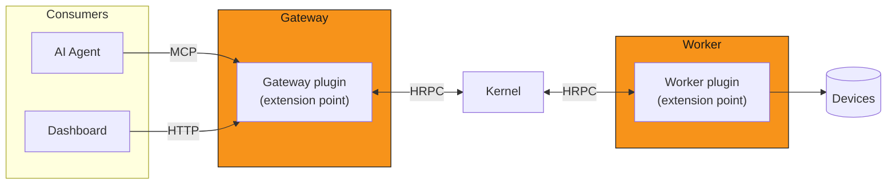

## How MDK works

MDK is built around a three tier ownership model:

- **Kernel is invariant** The Kernel provides small coordination layer every deployment runs unchanged: it routes validated commands to
  whichever Worker owns a device, and pulls telemetry back.
- **Extensions are yours** [Worker plugins][workers-concept] wrap a device family; [Gateway plugins][gateway-concept] add
  HTTP routes, aggregation, and auth. Both are code you write and own, isolated from the Kernel and from each other. Nothing above the Gateway is 
  required: a deployment can dispatch commands and pull telemetry with just [`@tetherto/mdk-client`][client-concept].
- **The UI devkit is optional** The [MDK App Toolkit][app-toolkit] is the supported path for teams that want one.

## The round trip

One request, traced end to end: an AI agent or a dashboard reaches a Gateway plugin's capability. A dashboard calls the
plugin's HTTP route directly; an [AI agent][ai-agents-docs] arrives instead through an MCP endpoint — a standalone
[`@tetherto/mdk-mcp`][mcp-readme] process, or one the Gateway auto-generates in-process from that plugin's routes. Either
way the plugin builds its own [`@tetherto/mdk-client`][client-concept] and dispatches a command through it.
[Kernel][kernel-concept] resolves which Worker owns the target device, forwards the command over the Worker's own
connection, and relays the result back through the same path: Gateway plugin, then caller. Telemetry travels the same
round trip in reverse, on demand: the Gateway plugin's client asks Kernel for a device's telemetry, Kernel forwards that
pull to the owning Worker and relays the answer straight back. Kernel also runs its own scheduled telemetry/health pulls
on a fixed cadence, independent of any caller: the two are separate triggers into the same path, not one waiting on the
other.

Both extension points sit at the edges of this trip, never in the middle: a **Worker contract** teaches Kernel about
one device family (the contract declares the capability surface; the plugin's handlers implement it), and a
**Gateway plugin** teaches the Gateway a new route. Kernel itself never changes.

## The three tiers

**[Gateway][gateway-concept]**: a container that hosts plugins and exposes them over HTTP. It is the active side of the
Kernel connection (it dials Kernel, never the reverse). This is the tier where *user*-level authentication, aggregation,
and business logic live. Aggregation here means the cross-Worker queries no single Worker can answer — site hashrate,
average temperature, cross-rack efficiency — resolved in controller code, since Kernel computes none of them. Kernel's own 
allowlist, when configured, gates which *connections* it accepts: a transport-level check, not a user identity.

**[Workers][workers-concept]**: the integration handlers between physical hardware and Kernel, and the source of truth
for that hardware's state. A Worker answers only when Kernel asks (identity, capabilities, telemetry, or a command) and
never calls Kernel unprompted.

**[Kernel][kernel-concept]**: the passive coordination layer. It never initiates contact with a caller; it discovers
Workers, routes commands to the one that owns a device, and pulls telemetry and health on its own cadence. It performs no
aggregation and stores no telemetry itself.

## Why HRPC?

Every hop above (Gateway to Kernel, Kernel to Worker) speaks [Hyperswarm RPC (HRPC)][hrpc-glossary]: an encrypted,
key-addressed peer-to-peer transport, not HTTP. A site network connects a fixed, known set of processes to each other, not
the open web; HRPC's key-based addressing means a Worker or Gateway is reachable the same way whether it sits on the same
host or across a DHT, with no separate TLS/cert story and no public-facing port to secure. The trade-off is a caller must
hold or discover the callee's public key before it can connect: there is no URL to type into a browser.

In practice: a caller sends one request and receives one response over that channel; a dropped connection is the client's problem 
to recover from: the next call through [`@tetherto/mdk-client`][client-concept] reconnects; Kernel does not buffer or replay what it couldn't
deliver while a link was down.

## What's authoritative, and what's cached

Kernel's own store holds only its Worker registry, device capabilities, and the write-command log: never telemetry.
Telemetry is Worker-owned: a Worker persists its own device history, and every telemetry read anywhere above it (Gateway
plugin, dashboard, agent) is a live pull through that chain, not a read from a Kernel-side cache. 

## The stack

Discover each layer's canonical docs:

| Layer | Package | Canonical doc |
|---|---|---|
| Workers | `@tetherto/mdk-worker-*`, one per vendor | [Device protocol adapters][workers-concept] |
| Worker Runtime | `@tetherto/mdk-worker` | [Worker runtime][worker-runtime] |
| Kernel | `@tetherto/mdk-kernel` | [Coordination kernel][kernel-concept] |
| Client SDK | `@tetherto/mdk-client` | [Protocol connector][client-concept] |
| Gateway | `@tetherto/mdk-gateway` | [Plugin host and HTTP surface][gateway-concept] |
| Gateway plugins | `@tetherto/mdk-plugins` | [Default plugins and the manifest format][plugins-readme] |
| MCP server | `@tetherto/mdk-mcp` | [Tools for AI agents][mcp-readme] |
| App Toolkit | Frontend packages | [The supported development path][app-toolkit] |

For the per-package detail in each workspace, read the [core package index][core-docs] and the [UI toolkit index][ui-index]. How many of
each a deployment runs is covered by [scalability][scalability].

## Next steps

- Understand [the integration model][integration-model]: what a Worker plugin and a Gateway plugin each get to do
- Understand [the storage model][storage-model]: where state actually lives as you scale
- Understand [what an app is][whats-an-app] in MDK terms
- Understand [scalability][scalability]: parallel Workers, parallel Kernels, and what's measured today
- Understand the [MDK App Toolkit][app-toolkit]: the recommended development path from Gateway backend to frontend packages
- [Connect an AI agent over MCP][ai-agents-docs]: the endpoint agents reach the fleet through, and the security envelope you supply

## Links

[client-concept]: ../../backend/core/client/README.md
<!-- docs@tether.io: client-concept → https://github.com/tetherto/mdk/blob/main/backend/core/client/README.md -->

[kernel-concept]: ../../backend/core/kernel/README.md
<!-- docs@tether.io: kernel-concept → https://github.com/tetherto/mdk/blob/main/backend/core/kernel/README.md -->

[gateway-concept]: ../../backend/core/gateway/README.md
<!-- docs@tether.io: gateway-concept → https://github.com/tetherto/mdk/blob/main/backend/core/gateway/README.md -->

[workers-concept]: ../../backend/workers/README.md
<!-- docs@tether.io: workers-concept → https://github.com/tetherto/mdk/blob/main/backend/workers/README.md -->

[hrpc-glossary]: ../reference/glossary.md#hyperswarm-rpc
<!-- docs@tether.io: hrpc-glossary → reference/glossary#hyperswarm-rpc -->

[mcp-readme]: ../../backend/core/mcp/README.md
<!-- docs@tether.io: mcp-readme → https://github.com/tetherto/mdk/blob/main/backend/core/mcp/README.md -->

[ai-agents-docs]: ../../backend/core/mcp/README.md#ai-agents-and-the-mcp-server
<!-- docs@tether.io: ai-agents-docs → https://github.com/tetherto/mdk/blob/main/backend/core/mcp/README.md#ai-agents-and-the-mcp-server -->

[storage-model]: the-storage-model.md
<!-- docs@tether.io: storage-model → concepts/the-storage-model -->

[integration-model]: the-integration-model.md
<!-- docs@tether.io: integration-model → concepts/the-integration-model -->

[whats-an-app]: whats-an-app.md
<!-- docs@tether.io: whats-an-app → concepts/whats-an-app -->

[scalability]: scalability.md
<!-- docs@tether.io: scalability → concepts/scalability -->

[app-toolkit]: app-toolkit.md
<!-- docs@tether.io: app-toolkit → https://github.com/tetherto/mdk/blob/main/docs/concepts/app-toolkit.md -->

[worker-runtime]: ../../backend/core/docs/README.md#worker-runtime-tethertomdk-worker
<!-- docs@tether.io: worker-runtime → https://github.com/tetherto/mdk/blob/main/backend/core/docs/README.md#worker-runtime-tethertomdk-worker -->

[plugins-readme]: ../../backend/core/plugins/README.md
<!-- docs@tether.io: plugins-readme → https://github.com/tetherto/mdk/blob/main/backend/core/plugins/README.md -->

[core-docs]: ../../backend/core/docs/README.md
<!-- docs@tether.io: core-docs → https://github.com/tetherto/mdk/blob/main/backend/core/docs/README.md -->

[ui-index]: ../../ui/README.md
<!-- docs@tether.io: ui-index → https://github.com/tetherto/mdk/blob/main/ui/README.md -->
