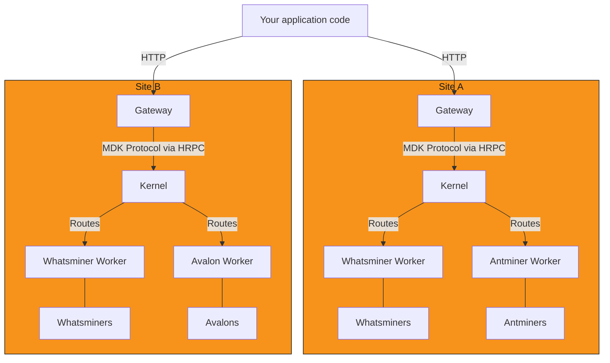
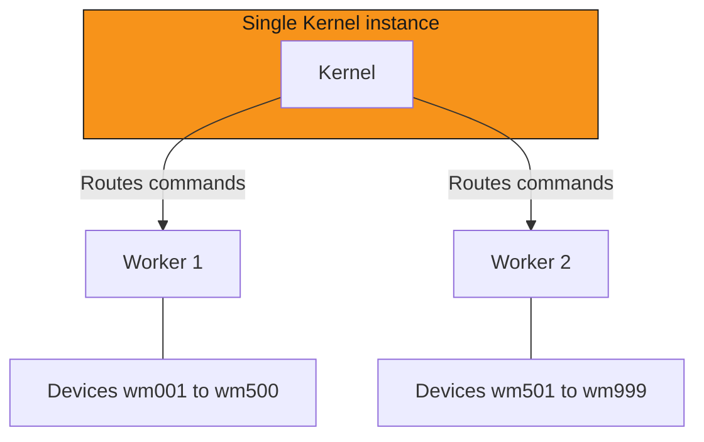

## Overview

Scale refers to *how many* Workers and Kernels a deployment runs, this includes:

- **Devices per Worker instance**: how many devices one running Worker manages. Bounded by the device protocol and
  the Worker's own connection model, not by Kernel
- **Worker instances per Kernel**: how many Worker processes one Kernel coordinates. Kernel places no hard cap;
  the practical limit is how much command/telemetry traffic one Kernel process can route
- **Kernels per Gateway**: today, one. `startGateway()` connects to exactly one Kernel (`kernelKey` is a single
  value), and `mdk.yaml` declares exactly one Kernel per stack

## Single-kernel versus multi-kernel

This page is not about *how those processes are packaged* on a host (one process versus many machines). That's an independent
[deployment topology][deployment-topologies-guide] choice. The topology distinction this page does own is, does your deployment run:

- One Kernel serving a site?
- Several independent Kernels, each serving its own site?

A single Kernel process routes commands and telemetry for every Worker registered to it, with no per-Worker partitioning.
Each Kernel is paired with its own Gateway (`startGateway()` connects to exactly one Kernel, and `mdk.yaml` declares exactly one Kernel per stack).

Add a second Kernel when you're adding a second physically- or organizationally-distinct site, not to work around a
single site's device count. You can run multiple independent sites with one Kernel per physical site (for example, Site A and
Site B). Each Kernel is fully isolated: Kernel instances do not federate registries, share queues, or synchronize state with
each other, and each runs behind its own Gateway.

No MDK component spans sites. Combining them into one view is your own application code calling each site's Gateway
separately, each Gateway still talking HRPC to its own Kernel, and merging the responses yourself.

## What parallel Workers and Kernels mean

Multiple Workers of the same type (for example, `whatsminer-worker`) can be active concurrently, connected to the same Kernel
instance.

Workers never share devices: device-to-Worker ownership is a strict, exclusive mapping the registry enforces, so
adding Worker instances scales device count linearly with no coordination between them. When Kernel discovers a Worker, its
identity response explicitly lists the `deviceId`s it exclusively manages, and the [Worker registry][kernel-registry] holds that
mapping. Kernel routes to whichever Worker owns a `deviceId`; it does not load-balance a device's traffic across multiple
Workers, because only one Worker is ever registered as the owner of a given device at a time.

## Where state lives as you grow

Each Kernel keeps its own [separate store][storage-model]: a multi-Kernel deployment means multiple independent stores, 
not one shared or federated one.

## Failure behavior

- A single Worker going offline degrades reads/writes for that Worker's devices only: Kernel continues routing to
  every other registered Worker
- A Kernel crash is recovered from its own command write-ahead log on restart: `recover()` restores in-flight commands to `QUEUED` and
  fails those out of retries, without re-sending either. It does not need to reconstruct device state, since it never owned it
- In a multi-Kernel deployment, a crash at one site has zero effect on any other, there's no
  shared state to become inconsistent

## Next steps

- Understand [the storage model][storage-model]: what grows with device count, and what doesn't
- Choose a [deployment topology][deployment-topologies-guide]: how processes are packaged on a host
- Understand [architecture][architecture]: the round trip every command and telemetry pull takes
- Read the [Gateway's connection model][gateway-readme]: how `startGateway()` resolves a single Kernel
- Measure a deployment yourself with the [benchmark harness][benchmark-harness]

## Links

[storage-model]: the-storage-model.md
<!-- docs@tether.io: storage-model → concepts/the-storage-model -->

[gateway-readme]: ../../backend/core/gateway/README.md
<!-- docs@tether.io: gateway-readme → https://github.com/tetherto/mdk/blob/main/backend/core/gateway/README.md -->

[kernel-registry]: ../../backend/core/kernel/README.md#workerregistry
<!-- docs@tether.io: kernel-registry → https://github.com/tetherto/mdk/blob/main/backend/core/kernel/README.md#workerregistry -->

[architecture]: architecture.md
<!-- docs@tether.io: architecture → concepts/architecture -->

[benchmark-harness]: ../../backend/tests/benchmark/README.md
<!-- docs@tether.io: benchmark-harness → https://github.com/tetherto/mdk/blob/main/backend/tests/benchmark/README.md -->

[deployment-topologies-guide]: ../guides/deployment/index.md
<!-- docs@tether.io: deployment-topologies-guide → guides/deployment -->
