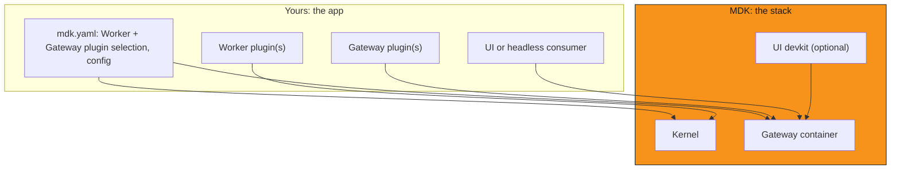

## Definition

An MDK app is a `mdk.yaml` declaring a Gateway with its plugins, one or more Workers, and their configuration, plus,
optionally, a UI or headless consumer built against that same Gateway.

## Anatomy

- **`mdk.yaml`**: the deployment unit. Names the stack, ports, which Worker packages run with what device config, and
  which Gateway plugins load with what config. This is what `mdk onboard`/`mdk create` write and `mdk run` reads.
- **Worker plugin(s)**: yours if you're integrating a new device family; reused if you picked one that already ships
  (an Antminer worker, a demo worker).
- **Gateway plugin(s)**: yours if you need a route no existing plugin exposes; reused for anything already bundled.
- **UI or headless consumer**: optional. A scaffolded dashboard, a script calling `@tetherto/mdk-client` directly, or
  nothing at all: Kernel and the Gateway don't require one.
- **Kernel and the Gateway container**: never yours to modify. They're the invariant core every app runs unchanged
  (see [Architecture][architecture]).

## What an app is not

- Not a fork of Kernel or the Gateway: you never edit their source to build an app.
- Not a monolith: a Worker plugin, a Gateway plugin, and a UI are independently swappable pieces, not one codebase.
- Not a replacement for the Kernel: an app always sits on top of it, never instead of it.

## Next steps

- Understand [the integration model][integration-model]: what a Worker plugin and a Gateway plugin each get to do
- Understand [architecture][architecture]: how the pieces of an app talk to each other
- Understand the [MDK App Toolkit][app-toolkit]: the layers a UI or headless consumer builds on
- [Build an app][build-an-app] from an empty directory

## Links

[architecture]: architecture.md
<!-- docs@tether.io: architecture → concepts/architecture -->

[integration-model]: the-integration-model.md
<!-- docs@tether.io: integration-model → concepts/the-integration-model -->

[build-an-app]: ../tutorials/build-a-dashboard.md
<!-- docs@tether.io: build-an-app → tutorials/build-a-dashboard -->

[app-toolkit]: app-toolkit.md
<!-- docs@tether.io: app-toolkit → https://github.com/tetherto/mdk/blob/main/docs/concepts/app-toolkit.md -->
